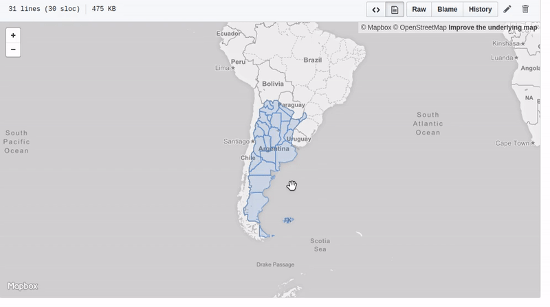

# Data Visualization with maps 

Example data visualization in Python (Jupyter Notebook). We will cover the pandas, geopandas. 
We will also touch upon data visualization graphics library in bokeh, folium, ipyleaflet and bqplot.

## Usage

**Loading a geojson map example:**

**Example Italy map:**

